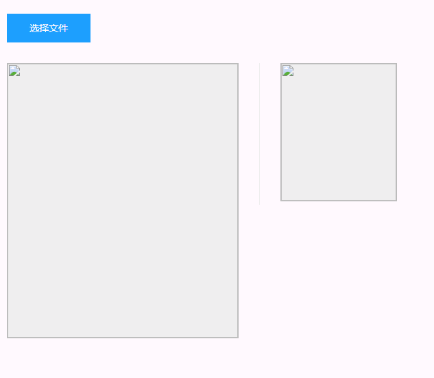

# 可拖拽预览的图片剪裁插件

> 组件功能特点：
>
> * 可在本地选择图片上传前进行裁剪
>
> * 可配置背景图片路径
>
> * 可通过拖拽虚线框实现图片的剪裁操作，虚线框能实时显示拖拽过程
>
> * 拖拽结束后会像父组件传递一个cutImg的事件并带回base64格式的剪裁后的图片路径
>
> * 按钮样式可自定义
>
> * 图片操作框（下图左侧）、图片预览框（下图右侧）大小可配置
>
> * 预览框可配置可见性（默认可见）
>
> * 图片拖拽框（图中虚线框）可定义起始位置及大小（默认为位置图片中心，大小为预览框大小）
>
>   <!--PS：拖拽框起始比例如果和预览框不一致，拖拽后仍以预览框比例为主（需注意如果预览框不可见时，重新定义拖拽框的大小需要将预览框大小一同调节）-->


### 组件效果



### 组件使用方式

```vue
<template>
	<cropper :Setting=setting @cutImg=getCutUrl></cropper>
<!--组件接收一个传入参数Setting（不传时均采取默认值），传出一个事件cutImg携带裁剪后的图片路径（base64位）-->
</template>
<script>
  import cropper from 'cropper/src/index';
  export default {
    components: {cropper};
    methods:{
      getCutUrl(data) {
        console.log('getCutUrl', data);
      }
    }
    data(){
      return {
        setting:{
          //背景图片的路径
          backgroundUrl: "",
          //图片操作区域宽度
          width: 336,
          //图片操作区域高度
          height: 400,
          //预览框的大小及可见性
          target: {
            w: 168, // 宽度
            h: 200, // 高度
            visible: true //是否显示
          },
          //拖拽框位置
          cutPos: {
            w: 0, // 宽度
            h: 0, // 高度
            x: 0, //相对父级左边距离 大于0有效
            y: 0 //相对父级顶部距离 大于0有效
          }, // 拖拽框的范围为照片的边界，如果xy过大超出边界后，以边界值为准
          // 按钮样式
          btnStyle: {}
         }
      }
    }
  }
</script>

```

